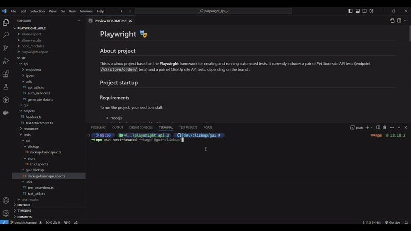
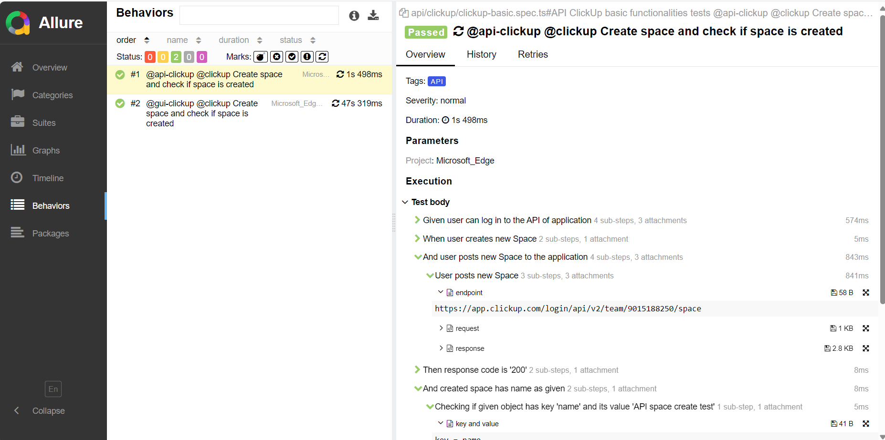
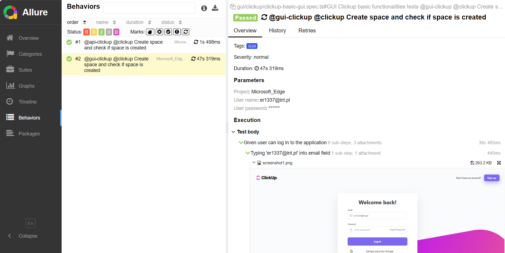

# Playwright 🎭

## About project

This is a *demo* project based on the **Playwirght** framework for creating and running automated tests. It currently includes a pair of *Pet Store* site API tests (endpoint `/v2/store/order/` tests) and a pair of ClickUp site API tests, depending on the branch.

## ❗ IMPORTANT - BUGS DETECTED ❗

- There is bug with getting screenshots in tests running in "headed" mode. Test are stucking at the moment of taking screenshot. Bug is reported: https://github.com/microsoft/playwright/issues/28995 . At this moment, there is workaround (prevent accessing some assets before each test) and tests with screenshots are working fine.

- Due to some Windows updates, there is bug with running `allure` to generate reports (`Error: spawn EINVAL` etc., [➡️*link to similar issue and solution*⬅️](https://community.sap.com/t5/technology-q-a/visual-code-studio-command-run-failed-with-error-spawn-einval/qaq-p/13670880)).

## Project startup

### Requirements

To run the project, you need to install:

- nodejs (**strongly recommended to install `16.20.2` version**)
- Java 8 or later (required by *Allure* tool to generate reports)

### Installation

1. Download (clone) this repository to a local folder
2. Navigate to the downloaded project directory
3. Switch to the appropriate branch (command `git checkout <branch_name>`)
4. Install the required libraries and dependencies (command `npm install`, this will install Playwright and others)
5. Install Playwright's *browsers* (command `npx playwright install`; Playwright has its own implementations of browsers that are used for testing, including API testing)

### Before running

- Reading sensitive data in the project, such as login data (username and password, API key etc.), is done using the `dotenv` tool - the data is read from the `.env` file located in the project's root folder. This file is ignored by git for security reasons and is not in the project. It has to be added from another source.

### Launching

The most important settings are in the `playwright.config.ts` file. There you can set, for example, the browsers used, or the base URL. Details of the settings can be found in the Playwright documentation. In the current version of this project, only the Edge browser is enabled, with one worker (that is, it runs one test at a time).

The basic command to run the tests is:

    npx playwright test

It can take different arguments and parameters - see Playwright's documentation for details.

In the `package.json` file, the `scripts` field contains *predefined* scripts. These are aliases for longer configurations of run commands. They must be specified as an argument to the `npx run` command, and so are possible:

- Run all tests containing the phrase `@api` in the name:
    
        npm run test:api

 
        
- Run all tests containing the phrase `test:action-log` in the name:

        npm run test:actionLog

 
        
- Generate the Allure report into a separate file (by default, the report will appear in the location `./allure-report/index.html`)

        npm run allure-report

 
        
- Generate the Allure report as a "server" (the generated report will be opened automatically in the default browser, it will not be a separate file):

        npm run show-allure-report

 
        
- Run tests by specifying the tag `<name_tag>` (only those tests with the specified phrase in their name will be run; currently only one tag can be specified):

        npm run test --tag='<tag_name>'

    For example, running the command `npm run test --tag='@examination'` will run only those tests whose name contains the phrase `@examination`. If the specified phrase is not in the name of any test, nothing will run.

 

- Run tests by specifying the tag `<name_tag>` as above, but in **headed** mode (borwser is opening):

        npm run test-headed --tag='<tag_name>'

    For example, running the command `npm run test --tag='@examination'` will run only those tests whose name contains the phrase `@examination`. If the specified phrase is not in the name of any test, nothing will run.

 
        
**❗Warning**  In the case of the first two commands, changing their contents will not trigger the running of other tests, e.g. the `npm run test:gui` command will not be run because it has not been *hardly* saved in the `package.json` file. These commands are still in development.

## Examples

- Example of running GUI test for checking if creating new ClickUp space works correct

 

- Example of report - results of API test (showing steps, enpoints, requests etc.)

 

- Example of report - results of GUI test (showing steps, screenshots etc.)

## Changelog

<strong>19.04.2024</strong>

- added test for checking if creating new list works correct (added new page, methods etc.)
- added tag "Space" to space gui test

 

<strong>18.04.2024</strong>

- changed target element when waiting for loading main view after creating new space (due to changes in ClickUp)
- introduced custom reporter for sending logs to console after actions
- added custom reporter to page classes
- added colors to custom logs

 

<strong>17.04.2024</strong>

- added deleting space (hook) after execution GUI and API tests for checking if creating new space works correct
- added common methods for performing actions like typing text, clicking etc.

